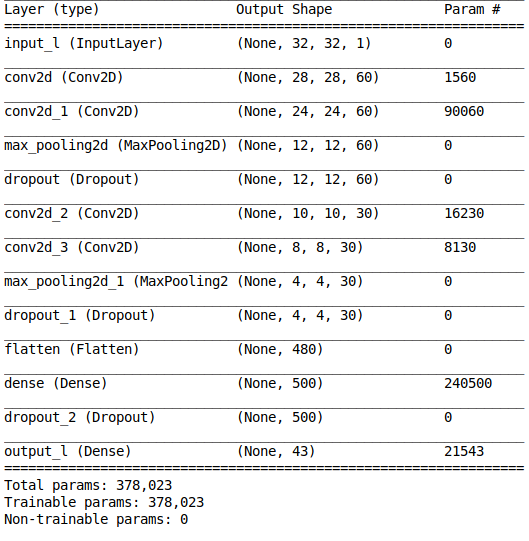

# CNN_traffic_sign
Traffic signs classification using CNN

## Overview
In this project I will create a model using Tensorflow which can identify the type of traffic sign from an image.
At the end I will also define a function which takes an url link as input (poining to traffic sign image),
load it, preprocess it and then display it with the predicted label!

Here you can download the [Dataset](https://bitbucket.org/jadslim/german-traffic-signs)

The dataset contains images (32x32 pixels) of german traffic signs.

## Results
### The model was able to correctly classify 97.94% of the test set!

## Preprocessing
- Convert the image to gray scale 
- histogram equalization to improve the contrast
- normalization

## Extra processes
- Data augmentation (train set and validation set)

## Hardware
For this project I have used a GTX 1050 Ti from NVIDIA

## Libraries
In order to execute the code you will need:
- Pillow
- requests
- numpy
- pandas
- matplotlib
- six
- opencv
- tensorflow
