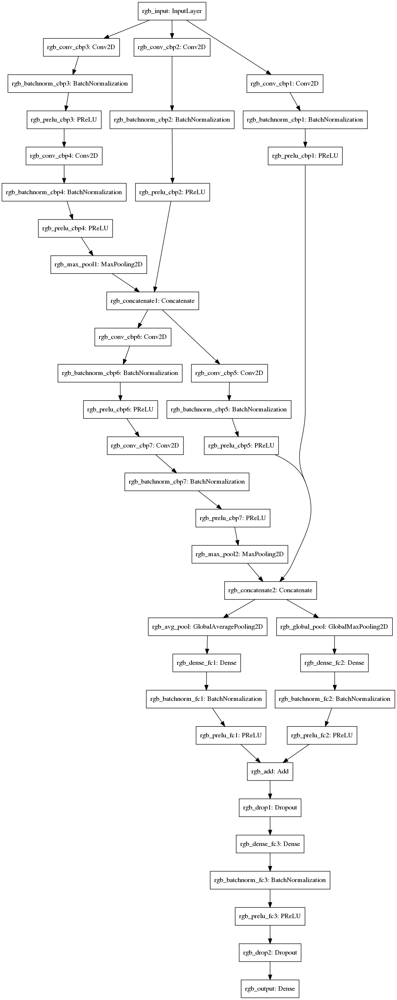

# CNN_traffic_sign
German traffic signs classification using CNN

## Detailes
A detailed documentation step by step can be found [here](https://davidforino-aisolutions.com/traffic-signs-cnn/)

Here you can download the [Dataset](https://bitbucket.org/jadslim/german-traffic-signs)

The dataset contains images (32x32 pixels) of german traffic signs.

## Results
### The model was able to correctly classify 99.612% of the test set!

## Hardware
For this project I have used a RTX 2080 from NVIDIA
